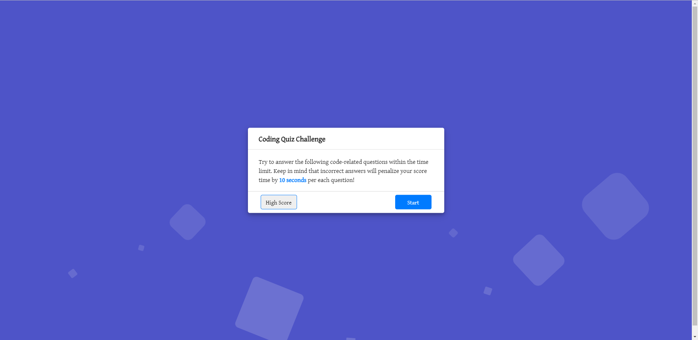

# My-Timed-Code-Quiz
Timed quiz on HTML/JavaScript fundamentals that stores high scores

## Description

This homework helped me learn coding assessment including both multiple-choice questions and interactive coding challenges on the way to become a full-stack web developer. The activities this week help familiarize you with these tests and allow to use the skills covered in this unit, and complete in building a timed coding quiz with multiple-choice questions. This app will run in the browser and will feature dynamically updated HTML and CSS powered by JavaScript code, having a clean, polished, and responsive user interface. 

The timed code quiz will run once the start button is clicked then a timer starts with a question, when answered another question shows, when answered incorrectly then the time is subtracted from the clock. When all questions are answered or the timer reaches 0 then the game is over, when the game is over type initials and save with score.

## Installation

Using the GitHub account, created a repository and project and pushed the homework files to the repository folder
In GitHub, navigated to jak3ster.github.io repository and click Settings.
Then within Settings, navigate to the Source section within the Github Pages section. 
From the dropdown menu, select master branch and then click Save.

Using the link at https://jak3ster.github.io/My-Timed-Code-Quiz/

## Usage

Screenshots added.

