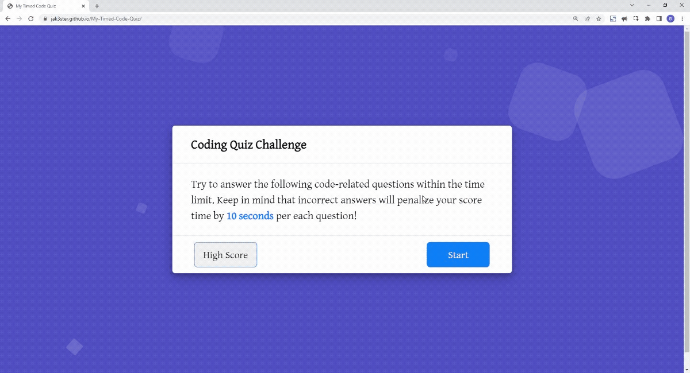

# My-Timed-Code-Quiz
Timed quiz on HTML/JavaScript fundamentals that stores high scores

## Description

This homework helped me learn coding assessment including both multiple-choice questions and interactive coding challenges on the way to become a full-stack web developer. The activities this week help familiarize you with these tests and allow to use the skills covered in this unit, and complete in building a timed coding quiz with multiple-choice questions. This app will run in the browser and will feature dynamically updated HTML and CSS powered by JavaScript code, having a clean, polished, and responsive user interface. 

The timed code quiz will run once the start button is clicked then a timer starts with a question, when answered another question shows, when answered incorrectly then the time is subtracted from the clock. When all questions are answered or the timer reaches 0 then the game is over, when the game is over type initials and save with score.

## Installation

1. Download or clone repository
2. Open the main page (index.html) on your browser to view webpage
3. Use a text editor to view all coding, Visual Studio Code (recommended editor)

## Usage

1. Click "Start Quiz"
* Timer on the top right will start to run
* Total time is 100 second with 8 questions in total
2. A series of questions are presented with multiple choice answers
* If the question is answered wrong, 10 seconds will be deducted to the timer
* If the question is answered correctly, will add 1 to the score
* After a question is answered, it will show on the bottom whether it is answered correctly or wrong. If wrong, will also show the correct answer.
3. When all questions are answered or the timer reaches 0, game is over
4. When game is over, the user can enter initial and score, click "Submit" to save to high scores to local storage
5. Click on "High Scores" button to view all current high scores or "Clear Scores" to clear saved scores
6. The user then will have the option to click on "Replay Quiz" to start quiz again

## Features
* HTML
* CSS
* JavaScript
* Bootstrap

## Demo

## Website & Repository

Deployed Link: https://jak3ster.github.io/My-Timed-Code-Quiz/
Github Repository: https://github.com/jak3ster/My-Timed-Code-Quiz